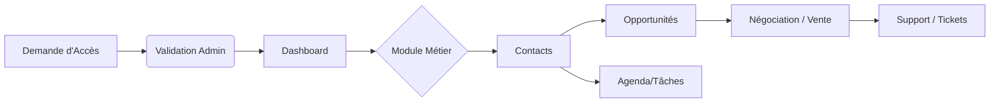

# 📗 Manuel de Référence Ultime - CRM Nexus Pro
*L'Excellence Opérationnelle au Service de votre Relation Client*

---

## 1. Introduction Conceptuelle
Le CRM Nexus Pro n'est pas qu'un outil de stockage ; c'est un **écosystème dynamique** conçu pour centraliser l'intelligence commerciale. Sa structure repose sur la fluidité de l'information entre les collaborateurs et la traçabilité totale des échanges.

### 🧩 Logique de Flux (Workflow)

---

## 2. Accès et Installation (Multi-Support)

### 💻 Sur Ordinateur (Desktop)
L'interface est optimisée pour de grands écrans avec une **Navigation Latérale (Sidebar)** fixe.
*   **Connexion** : via l'adresse sécurisée de votre entreprise.
*   **Navigation** : Le menu à gauche reste accessible en permanence.

### 📱 Sur Mobile (Smartphone & Tablette)
L'interface s'adapte (Responsive Design). Le menu est rétractable pour libérer de l'espace.
*   **Menu Hamburger (☰)** : Situé en haut à droite, il contient l'intégralité des modules.
*   **Installation PWA (Le secret de la productivité)** :
    *   **Android (Chrome)** : Cliquez sur le bouton bleu **"Télécharger"** dans l'en-tête, puis validez.
    *   **iOS (Safari)** : Cliquez sur **"Télécharger"**, puis sur l'icône **Partager** (carré + flèche haut) et sélectionnez **"Sur l'écran d'accueil"**.

---

## 3. Dictionnaire Visuel des Icônes
Pour vous aider à naviguer, voici la signification des symboles récurrents :
*   🔥 : **Nouveau Contact** (Prospect froid).
*   🤝 : **Négociation** (Affaire en cours).
*   👑 : **Client** (Relation établie).
*   📅 : **Agenda** (Rendez-vous programmé).
*   ⚡ : **Action Rapide** (Création ou conversion).

---

## 4. Analyse Fonctionnelle des Modules

### 4.1. Le Tableau de Bord (Centre de Pilotage)
*   **Utilité** : Analyse instantanée de la santé commerciale.
*   **Fonctionnalités Clés** :
    *   **KPI Cards** : Compteurs temps réel (Points de vente, Chiffre d'affaires potentiel).
    *   **Historique d'Acquisition** : Courbe de tendance comparant les entrées brutes et les ventes réelles.
*   **Interconnexion** : Les données du Dashboard sont le reflet direct des actions effectuées dans les modules "Contacts" et "Opportunités".

### 4.2. Gestion des Contacts (Référentiel Central)
*   **Utilité** : Centralisation de l'identité client et de l'historique social.
*   **Logique de Navigation** :
    *   **Listing** : Filtrage par source (Web, Email, Tel) pour mesurer l'efficacité des canaux.
    *   **Fiche Détail** : Véritable "fiche d'identité" regroupant le journal des appels, les documents joints et les opportunités liées.
*   **Bouton Stratégique - "Convertir"** : Permet de basculer un contact dans le pipeline de vente sans double saisie.

### 4.3. Pipeline des Ventes (Moteur Économique)
*   **Utilité** : Visualisation du processus de vente étape par étape.
*   **Fonctionnalités Clés** :
    *   **Vue Kanban** : Colonne de gauche (Prospection) vers la droite (Gagné).
    *   **Stades de Transition** : Lors d'un passage au stade "Qualification" ou "Proposition", le système impose la saisie du budget et du besoin pour garantir la qualité des données.
*   **Logique de Navigation** : Glissez-déposez les cartes sur ordinateur, ou utilisez le menu de changement d'état sur mobile.

### 4.4. Agenda et Tâches (Organisation)
*   **Utilité** : Gestion du temps et évitement des oublis (Relances clients).
*   **Détails** : Synchronisation entre les tâches affectées à un contact et votre calendrier global.
*   **Le petit plus** : Des notifications internes vous rappellent vos échéances 15 minutes avant.

### 4.5. Administration (Sécurité et Gouvernance)
*   **Journal d'Audit** : Traçabilité de chaque modification (Qui ? Quoi ? Quand ?).
*   **Paramètres Système** : Configuration du Logo, des couleurs dominantes et des règles RGPD pour l'export des données.

---

## 5. Guide de Résolution Rapide (FAQ)

> [!IMPORTANT]
> **Le bouton "Télécharger" ne s'affiche pas ?**
> C'est probablement parce que vous utilisez un navigateur non compatible (comme le navigateur interne de Facebook) ou que l'application est déjà installée sur votre écran. Utilisez exclusivement **Chrome** (Android) ou **Safari** (iPhone).

> [!TIP]
> **Comment gagner du temps ?**
> Utilisez la barre de recherche en haut de la liste des contacts dès que vous avez plus de 50 enregistrements. C'est l'outil le plus rapide du CRM.

---
*Ce document est la propriété de votre organisation. Nexus Pro CRM - Version Elite.*
